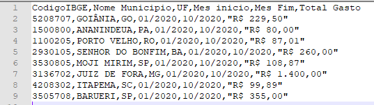

# Aplicação consumo API Portal da Transparência

Aplicação que realiza consulta na API publica do [portal da transparência](http://www.portaltransparencia.gov.br/swagger-ui.html#/Gastos32por32meio32de32cart227o32de32pagamento)
com a finalidade de retornar os gastos públicos por meio de cartão de pagamento. Retornando um arquivo csv com 
informações de gastos por município.

## Stack

As tecnologias e ferramentas utilizadas foram:
- Java 11
- Spring framework (2.4.2)
  - Spring boot
  - Spring security
  - Spring data
  - Spring web
  - Spring validation
- Thymeleaf (integrado ao spring)
- FlyWay
- Bootstrap
- Apache Commons-CSV

## Segurança

Foi implementado um nível simples de segurança com tela de login utilizando spring-security

Para se autenticar, basta utilizar as seguintes credenciais (Mock):
```
usuario: user
senha: userPass
```

## Chave API publica

Para acessar a API é necessário utilizar uma chave informada no cabeçalho de cada requisição para a API.

A chave pode ser cadastrada no [site](http://www.portaldatransparencia.gov.br/api-de-dados/cadastrar-email) e seguir 
as instruções, e seguindo as recomendações de horário da mesma.


Com a chave cadastrada é necessário adicioná-la no arquivo ```application.properties``` da seguinte forma:
```properties
api.chave=3b592f198516a68a7742793ac92ff
```
Caso a chave seja inválida receberá um erro com status 401

## URL API

A url de consumo da API tbm deve ser informada no arquivo ```application.properties```
```properties
api.url=http://www.portaltransparencia.gov.br/api-de-dados/cartoes
```

## Banco de Dados

O banco de dados usado está configurado no arquivo ```docker-compose.yml``` utilizando a imagem mysql:latest com as 
seguintes configurações de enviroment para criação do banco.

```yml
MYSQL_ROOT_PASSWORD: j8S5HD^ET^v
MYSQL_USER: userDb
MYSQL_PASSWORD: Brp03diMFxbZ
MYSQL_DATABASE: portal-transparencia
```

Porém pode ser usado a conexão com qualquer outro banco MySQL, sendo necessário alterar os dados de conexão no arquivo
```application.properties```
```properties
spring.datasource.url=jdbc:mysql://localhost:3306/portal-transparencia
spring.datasource.username=userDb
spring.datasource.password=Brp03diMFxbZ
```

Também foi adicionado a dependência do flyway para controle de versão do banco de dados, sendo que toda atualização 
de banco de dados deverá ser adicionada em um arquivo SQL dentro do diretório resources/db/migration. O acesso ao banco
pelo flyway também deverá ser configurado no arquivo ```application.properties``` seguindo a configuração de conexão
com o banco.
```properties
flyway.user=userDb
flyway.password=Brp03diMFxbZ
flyway.schemas=portal-transparencia
flyway.url=jdbc:mysql://localhost:3306
```

## Execução

Para executar a aplicação basta executar o comando ```mvn clean spring-boot:run``` e acessar a url 
http://localhost:8887/gasto-portal-transparencia

### Tela de login


### Tela aplicação


### Arquivo gerado


OBS:. O arquivo é gerado com encode UTF-8, podendo ter caracteres desconfigurados sendo aberto com outro encode. 